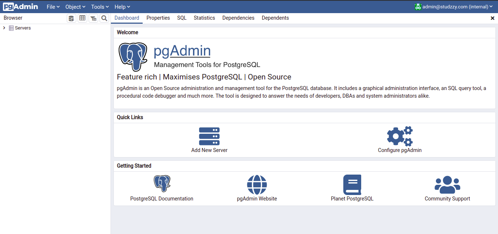

# Studzzy

This is a student time management program.

## Setup

Setup instructions for running the application

1. ### Installing Docker.

    Docker is a container runtime application that we will use to run the database and database web interface.
    * **On Windows.** \
        [Windows installation instructions](https://docs.docker.com/docker-for-windows/install/)

    * **On Linux (Ubuntu).** \
        [Linux installation instructions](https://docs.docker.com/engine/install/ubuntu/)
      
2. ### Installing Docker Compose.

    Docker compose is a container orchestration application that saves us the hassle of configuring and running each individual container manually. \
    It acts as some sort of autopilot that ensures that our DB infrastructure runs smoothly.
    * **On Windows.**\
        Good news !\
        Docker desktop comes preinstalled with docker compose so just move on to step 3.
      
    * **On linux.**\
        Run the following commands on terminal.
        ```bash
          sudo curl -L "https://github.com/docker/compose/releases/download/1.29.2/docker-compose-$(uname -s)-$(uname -m)" -o /usr/local/bin/docker-compose
        ```
        ```bash
          sudo chmod +x /usr/local/bin/docker-compose
        ```
3. ### Running our server stack.
    1. While at the root of the project directory, run the following commands
        on the terminal/CMD
        ```bash
          docker-compose up --build
        ```
    2. Wait for a few minutes while the server stack finishes the setup process.
    3. On your web browser, type the following URL. \
        [http://localhost:5050](http://localhost:5050) **OR** [http://127.0.0.1:5050]("http://127.0.0.1:5050")
      
    4. You should see a page like this. \
        
      
    5. Login using the following credentials:
        * Email Address: **admin@studzzy.com**
        * Password: **57udzzy@123#**
    6. After successful login you should be redirected to the following page. \
        
      
    7. Click on add new server. \
        
       
    8. A popup will appear, enter the following details: \
       * Name: **studzzy-server**
        
       
    9. Click on the **Connection** tab above and enter the following details: \
       * Host Name/address: **172.20.0.2**
       * Username: **studzzy**
       * Password: **57udzzy@123#** 
        
         
    10. After successful configuration you should be redirected to the following page. \
        


